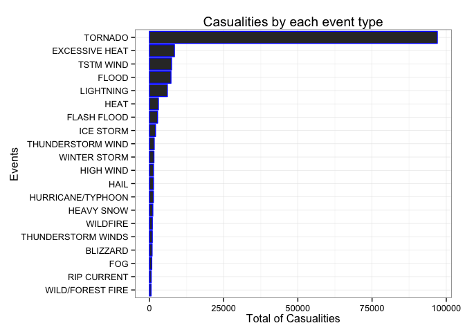
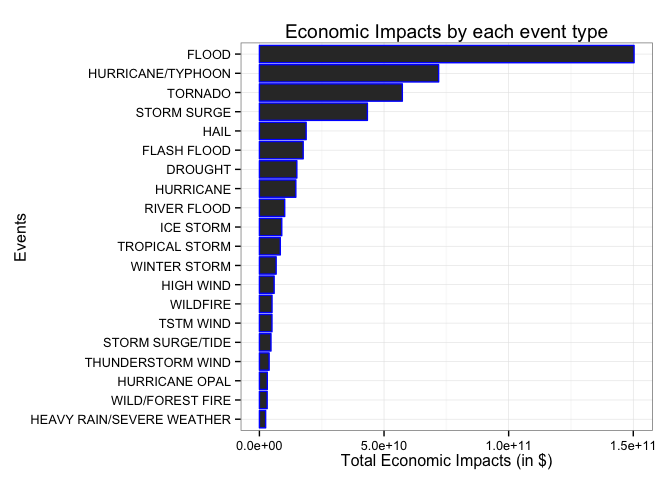

# NOAA Storm Impacts Analysis for Population's Health and Economy
Martin Cote  
2015-03-22  

# Synopsis

The analysis of the NOAA storm data is completed by creating 2 plots from data summary of the raw data.  The first plot is created by combining the impacts to population's health (namely casualities) and showing in a descending order, from greatest to lowest, the total of casualties per events' type.  The second plot is obtained by combining all variables related to the economic impacts and showing in a descending order, from greatest to lowest, the total of economic impacts per events' type.

# Data Processing

## Pre-Requisites
1. The file must be present within the working directory.
2. No pre-processing is performed to the file downloaded.  In its raw form, the file is a '.csv.bz2' file and will be read from that format.
3. Installed libraries required are DPLYR, TIDYR and GGPLOT2.

## Reading the NOAA raw data

Loading the necessary libraries and the NOAA raw data (directly obtained from the course website).


```r
# Loading libraries
library(dplyr)
```

```
## 
## Attaching package: 'dplyr'
## 
## The following object is masked from 'package:stats':
## 
##     filter
## 
## The following objects are masked from 'package:base':
## 
##     intersect, setdiff, setequal, union
```

```r
library(tidyr)
library(ggplot2)
```


```r
# This section of code is cached due to the time required to load the original data set.

# Validating that the file is present.
if ( !("repdata-data-StormData.csv.bz2" %in% dir()) ) {
  stop("ERROR: Files 'repdata-data-StormData.csv.bz2' do not exist within the working directory.")
}

# Reading the raw data - time intensive!
# Separating the original code line given since it is more efficient.
bzfile <- bzfile("repdata-data-StormData.csv.bz2")
csv_dataframe <- read.csv(bzfile, header=TRUE) # Extremely slow!!
noaa_data <- tbl_df(csv_dataframe)

# Print overall summary of the data for investigation.
str(noaa_data)
```

```
## Classes 'tbl_df', 'tbl' and 'data.frame':	902297 obs. of  37 variables:
##  $ STATE__   : num  1 1 1 1 1 1 1 1 1 1 ...
##  $ BGN_DATE  : Factor w/ 16335 levels "1/1/1966 0:00:00",..: 6523 6523 4242 11116 2224 2224 2260 383 3980 3980 ...
##  $ BGN_TIME  : Factor w/ 3608 levels "00:00:00 AM",..: 272 287 2705 1683 2584 3186 242 1683 3186 3186 ...
##  $ TIME_ZONE : Factor w/ 22 levels "ADT","AKS","AST",..: 7 7 7 7 7 7 7 7 7 7 ...
##  $ COUNTY    : num  97 3 57 89 43 77 9 123 125 57 ...
##  $ COUNTYNAME: Factor w/ 29601 levels "","5NM E OF MACKINAC BRIDGE TO PRESQUE ISLE LT MI",..: 13513 1873 4598 10592 4372 10094 1973 23873 24418 4598 ...
##  $ STATE     : Factor w/ 72 levels "AK","AL","AM",..: 2 2 2 2 2 2 2 2 2 2 ...
##  $ EVTYPE    : Factor w/ 985 levels "   HIGH SURF ADVISORY",..: 834 834 834 834 834 834 834 834 834 834 ...
##  $ BGN_RANGE : num  0 0 0 0 0 0 0 0 0 0 ...
##  $ BGN_AZI   : Factor w/ 35 levels "","  N"," NW",..: 1 1 1 1 1 1 1 1 1 1 ...
##  $ BGN_LOCATI: Factor w/ 54429 levels ""," Christiansburg",..: 1 1 1 1 1 1 1 1 1 1 ...
##  $ END_DATE  : Factor w/ 6663 levels "","1/1/1993 0:00:00",..: 1 1 1 1 1 1 1 1 1 1 ...
##  $ END_TIME  : Factor w/ 3647 levels ""," 0900CST",..: 1 1 1 1 1 1 1 1 1 1 ...
##  $ COUNTY_END: num  0 0 0 0 0 0 0 0 0 0 ...
##  $ COUNTYENDN: logi  NA NA NA NA NA NA ...
##  $ END_RANGE : num  0 0 0 0 0 0 0 0 0 0 ...
##  $ END_AZI   : Factor w/ 24 levels "","E","ENE","ESE",..: 1 1 1 1 1 1 1 1 1 1 ...
##  $ END_LOCATI: Factor w/ 34506 levels ""," CANTON"," TULIA",..: 1 1 1 1 1 1 1 1 1 1 ...
##  $ LENGTH    : num  14 2 0.1 0 0 1.5 1.5 0 3.3 2.3 ...
##  $ WIDTH     : num  100 150 123 100 150 177 33 33 100 100 ...
##  $ F         : int  3 2 2 2 2 2 2 1 3 3 ...
##  $ MAG       : num  0 0 0 0 0 0 0 0 0 0 ...
##  $ FATALITIES: num  0 0 0 0 0 0 0 0 1 0 ...
##  $ INJURIES  : num  15 0 2 2 2 6 1 0 14 0 ...
##  $ PROPDMG   : num  25 2.5 25 2.5 2.5 2.5 2.5 2.5 25 25 ...
##  $ PROPDMGEXP: Factor w/ 19 levels "","-","?","+",..: 17 17 17 17 17 17 17 17 17 17 ...
##  $ CROPDMG   : num  0 0 0 0 0 0 0 0 0 0 ...
##  $ CROPDMGEXP: Factor w/ 9 levels "","?","0","2",..: 1 1 1 1 1 1 1 1 1 1 ...
##  $ WFO       : Factor w/ 542 levels ""," CI","%SD",..: 1 1 1 1 1 1 1 1 1 1 ...
##  $ STATEOFFIC: Factor w/ 250 levels "","ALABAMA, Central",..: 1 1 1 1 1 1 1 1 1 1 ...
##  $ ZONENAMES : Factor w/ 25112 levels "","                                                                                                                               "| __truncated__,..: 1 1 1 1 1 1 1 1 1 1 ...
##  $ LATITUDE  : num  3040 3042 3340 3458 3412 ...
##  $ LONGITUDE : num  8812 8755 8742 8626 8642 ...
##  $ LATITUDE_E: num  3051 0 0 0 0 ...
##  $ LONGITUDE_: num  8806 0 0 0 0 ...
##  $ REMARKS   : Factor w/ 436781 levels "","\t","\t\t",..: 1 1 1 1 1 1 1 1 1 1 ...
##  $ REFNUM    : num  1 2 3 4 5 6 7 8 9 10 ...
```

```r
#summary(noaa_data)

# Print begining of the data...
noaa_data
```

```
## Source: local data frame [902,297 x 37]
## 
##    STATE__           BGN_DATE BGN_TIME TIME_ZONE COUNTY COUNTYNAME STATE
## 1        1  4/18/1950 0:00:00     0130       CST     97     MOBILE    AL
## 2        1  4/18/1950 0:00:00     0145       CST      3    BALDWIN    AL
## 3        1  2/20/1951 0:00:00     1600       CST     57    FAYETTE    AL
## 4        1   6/8/1951 0:00:00     0900       CST     89    MADISON    AL
## 5        1 11/15/1951 0:00:00     1500       CST     43    CULLMAN    AL
## 6        1 11/15/1951 0:00:00     2000       CST     77 LAUDERDALE    AL
## 7        1 11/16/1951 0:00:00     0100       CST      9     BLOUNT    AL
## 8        1  1/22/1952 0:00:00     0900       CST    123 TALLAPOOSA    AL
## 9        1  2/13/1952 0:00:00     2000       CST    125 TUSCALOOSA    AL
## 10       1  2/13/1952 0:00:00     2000       CST     57    FAYETTE    AL
## ..     ...                ...      ...       ...    ...        ...   ...
## Variables not shown: EVTYPE (fctr), BGN_RANGE (dbl), BGN_AZI (fctr),
##   BGN_LOCATI (fctr), END_DATE (fctr), END_TIME (fctr), COUNTY_END (dbl),
##   COUNTYENDN (lgl), END_RANGE (dbl), END_AZI (fctr), END_LOCATI (fctr),
##   LENGTH (dbl), WIDTH (dbl), F (int), MAG (dbl), FATALITIES (dbl),
##   INJURIES (dbl), PROPDMG (dbl), PROPDMGEXP (fctr), CROPDMG (dbl),
##   CROPDMGEXP (fctr), WFO (fctr), STATEOFFIC (fctr), ZONENAMES (fctr),
##   LATITUDE (dbl), LONGITUDE (dbl), LATITUDE_E (dbl), LONGITUDE_ (dbl),
##   REMARKS (fctr), REFNUM (dbl)
```

## Preparing the data for analysis (i.e. "tidy data")

Creating the variable combining the effect on population's health.


```r
noaa_healthimpacts <- noaa_data %>%
  mutate(HEALTHIMPACTS = (FATALITIES + INJURIES)) %>%
  select(EVTYPE, STATE, HEALTHIMPACTS, FATALITIES, INJURIES)
```

Creating the variable combining the effect on economy and consequences.

*Note*: Since the PROPDM and CROPDM are expressed in various decades (i.e. sometimes 2.5 is 2.5 billions or 2.5 millions), the data needs to be massaged to express all damages in the same unit basis.  I have personally chose to have the 'H' character to mean "hundred" in this scenario (since it wasn't specified, as refer to the discussion boards).


```r
noaa_economicimpacts <- noaa_data %>%
  mutate(PROPDMGEXP_INT = ifelse(PROPDMGEXP == "B", 1000000000,
                   ifelse(PROPDMGEXP == "M", 1000000,
                   ifelse(PROPDMGEXP == "K", 1000,
                   ifelse(PROPDMGEXP == "H", 100, 0))))
          ) %>%
  mutate(CROPDMGEXP_INT = ifelse(CROPDMGEXP == "B", 1000000000,
                   ifelse(CROPDMGEXP == "M", 1000000,
                   ifelse(CROPDMGEXP == "K", 1000,
                   ifelse(CROPDMGEXP == "H", 100, 0))))
          ) %>%
  mutate(ECONOMICIMPACTS = ((PROPDMG * PROPDMGEXP_INT) + (CROPDMG * CROPDMGEXP_INT) )) %>%
  select(EVTYPE,STATE, ECONOMICIMPACTS, PROPDMG, PROPDMGEXP_INT, CROPDMG, CROPDMGEXP_INT)
```


## Performing the exploratory data analysis
### First question...
1. Across the United States, which types of events (as indicated in the EVTYPE variable) are most harmful with respect to population health?

Using a combination of all variables related to population's health, producing a plot showing the total impacts per type of events (due to the number of type of events, a filter is applied to display __only the first 20 positions__).


```r
# Create health impacts summary data
noaa_healthsummary <- noaa_healthimpacts %>%
  group_by(EVTYPE) %>%
  summarise(HEALTHIMPACTS_TOT = sum(HEALTHIMPACTS)) %>%
  arrange(desc(HEALTHIMPACTS_TOT)) %>%
  slice(1:20)

# Print overall report
noaa_healthsummary
```

```
## Source: local data frame [20 x 2]
## 
##                EVTYPE HEALTHIMPACTS_TOT
## 1             TORNADO             96979
## 2      EXCESSIVE HEAT              8428
## 3           TSTM WIND              7461
## 4               FLOOD              7259
## 5           LIGHTNING              6046
## 6                HEAT              3037
## 7         FLASH FLOOD              2755
## 8           ICE STORM              2064
## 9   THUNDERSTORM WIND              1621
## 10       WINTER STORM              1527
## 11          HIGH WIND              1385
## 12               HAIL              1376
## 13  HURRICANE/TYPHOON              1339
## 14         HEAVY SNOW              1148
## 15           WILDFIRE               986
## 16 THUNDERSTORM WINDS               972
## 17           BLIZZARD               906
## 18                FOG               796
## 19        RIP CURRENT               600
## 20   WILD/FOREST FIRE               557
```


### Second question...
2. Across the United States, which types of events have the greatest economic consequences?

Using a combination of all variables related to economic impacts, producing a plot showing the total cost per type of events (due to the number of type of events, a filter is applied to display __only the first 20 positions__).


```r
# Prepare the summary
noaa_economicsummary <- noaa_economicimpacts %>%  
  group_by(EVTYPE) %>%
  summarise(EONOMICIMPACTS_TOT = sum(ECONOMICIMPACTS)) %>%
  arrange(desc(EONOMICIMPACTS_TOT)) %>%
  slice(1:20)

# Print overall report
noaa_economicsummary
```

```
## Source: local data frame [20 x 2]
## 
##                       EVTYPE EONOMICIMPACTS_TOT
## 1                      FLOOD       150319678250
## 2          HURRICANE/TYPHOON        71913712800
## 3                    TORNADO        57340613590
## 4                STORM SURGE        43323541000
## 5                       HAIL        18752904670
## 6                FLASH FLOOD        17562128610
## 7                    DROUGHT        15018672000
## 8                  HURRICANE        14610229010
## 9                RIVER FLOOD        10148404500
## 10                 ICE STORM         8967041310
## 11            TROPICAL STORM         8382236550
## 12              WINTER STORM         6715441250
## 13                 HIGH WIND         5908617560
## 14                  WILDFIRE         5060586800
## 15                 TSTM WIND         5038935790
## 16          STORM SURGE/TIDE         4642038000
## 17         THUNDERSTORM WIND         3897964190
## 18            HURRICANE OPAL         3161846000
## 19          WILD/FOREST FIRE         3108626330
## 20 HEAVY RAIN/SEVERE WEATHER         2500000000
```


# Results

Based on the analysis completed above, the most impactful events, in term of both population and economy are quite different.  Although lower on population's health impacts, the cost to flood/hurricane is greater.  Those results are clearer when displayed within plots showing those summaries.

__Population's Health Impacts:__

```r
# Prepare and print the overall plot
ggplot(noaa_healthsummary, aes(x=reorder(EVTYPE, HEALTHIMPACTS_TOT), y=HEALTHIMPACTS_TOT)) +
  geom_histogram(col="blue", stat="identity") + # 'stat="identity" ' required since I specified the 'y' axis data.
  xlab("Events") +
  ylab("Total of Casualities") +
  coord_flip() + # Showing the events name on the Y axis since it's easier to read.
  labs(title="Casualities by each event type") +
  theme_bw()
```

 

__Economic Impacts:__

```r
# Prepare and print the overall plot
ggplot(noaa_economicsummary, aes(x=reorder(EVTYPE, EONOMICIMPACTS_TOT), y=EONOMICIMPACTS_TOT)) +
  geom_histogram(col="blue", stat="identity") + # 'stat="identity" ' required since I specified the 'y' axis data.
  xlab("Events") +
  ylab("Total Economic Impacts (in $)") +
  coord_flip() + # Showing the events name on the Y axis since it's easier to read.
  labs(title="Economic Impacts by each event type") +
  theme_bw()
```

 


# References (if applicable)
1. The [National Weather Service Instruction - Storm Data Preparation](https://d396qusza40orc.cloudfront.net/repdata%2Fpeer2_doc%2Fpd01016005curr.pdf)
2. The [NOAA Storm Data FAQ](https://d396qusza40orc.cloudfront.net/repdata%2Fpeer2_doc%2FNCDC%20Storm%20Events-FAQ%20Page.pdf)
